# LAZEU

**A study companion where quizzing and hanging out with friends aren't two separate apps.**

#### Video Demo: <https://youtu.be/P7BvGZUm41U>

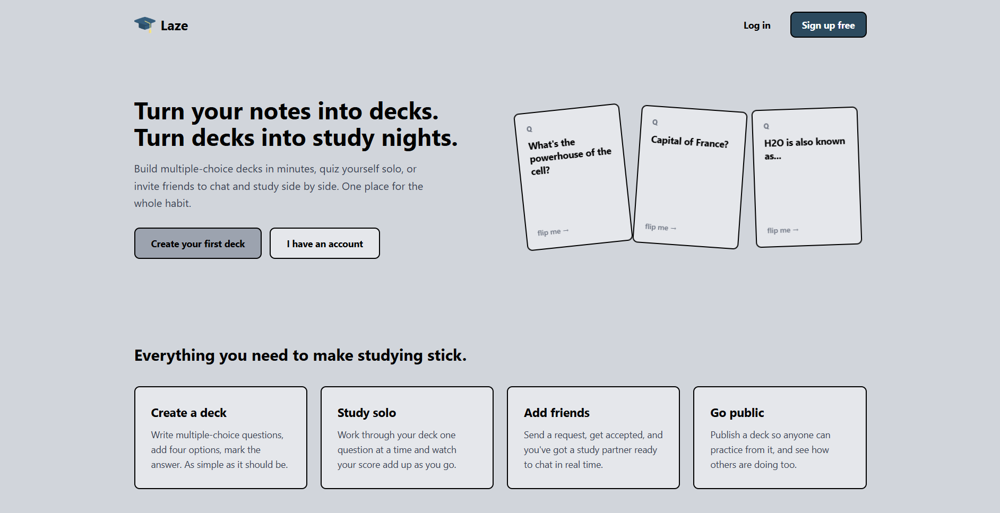

---

## About

Laze is a full-stack study app I built with React on the frontend and Supabase doing basically everything else on the backend. The idea came from just being annoyed at how studying tools usually work — you've either got a bare-bones flashcard app with zero social features, or something bloated that tries to do too much. I liked how simple the Gizmo web app made building quizzes, but I also wanted an actual friends list and real chat, so studying didn't feel like sitting alone in a room.

So with Laze you can make an account, build multiple-choice decks, quiz yourself on them, share decks publicly so other people can use them too, add friends, and message them live. One Supabase project handles the auth, the database, file storage, and realtime — all of it.

### Why Supabase over Firebase

Honestly it came down to wanting a real relational database I could write SQL against instead of fighting NoSQL data shapes. Supabase gives me Postgres, row-level security, storage, auth, and realtime channels in one place, so I wasn't stitching four different services together. It also meant I could just write a SQL view (`my_friends`, more on that below) instead of reshaping join data in JavaScript every single time I needed it.

---

## Screenshots

### Dashboard
Where you land after logging in — decks, friends, and quick access to studying, all in one spot.

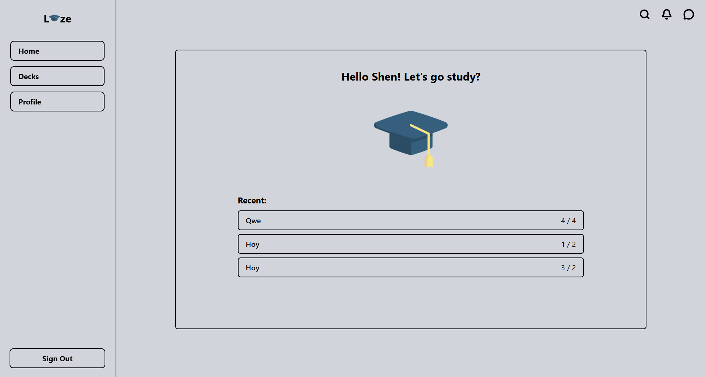

### Decks & Cards
Make a deck, then start adding multiple-choice questions to it.

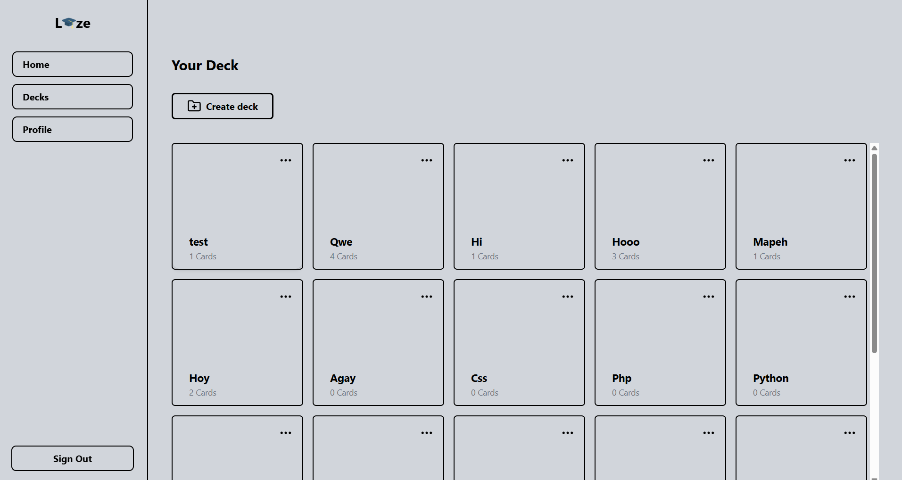
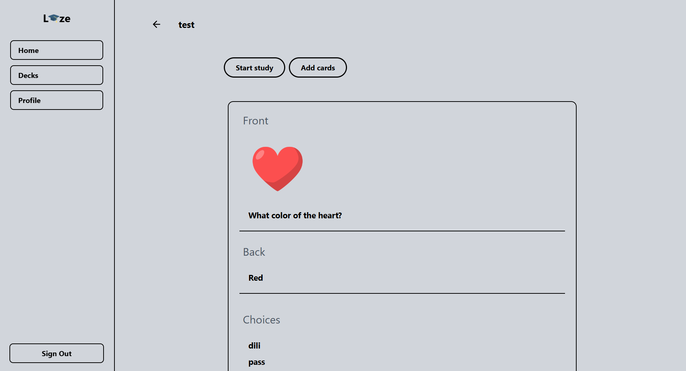

### Quiz & Results
Go through the deck question by question, see your score at the end.

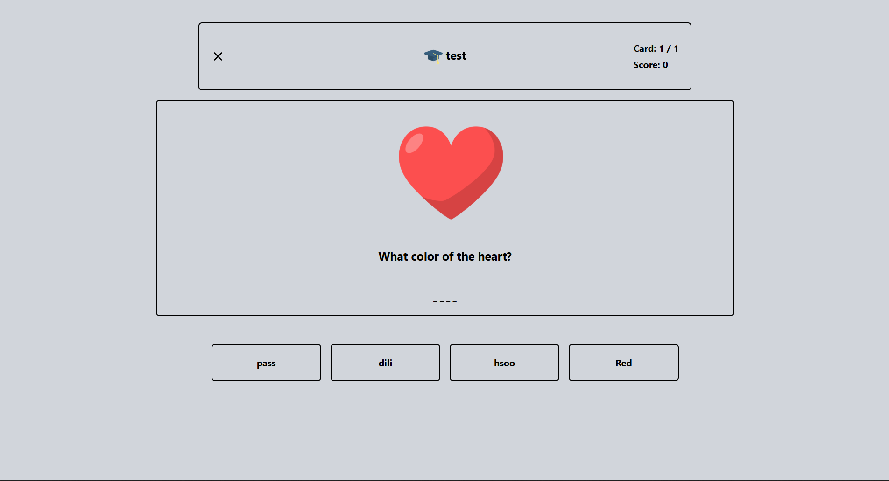
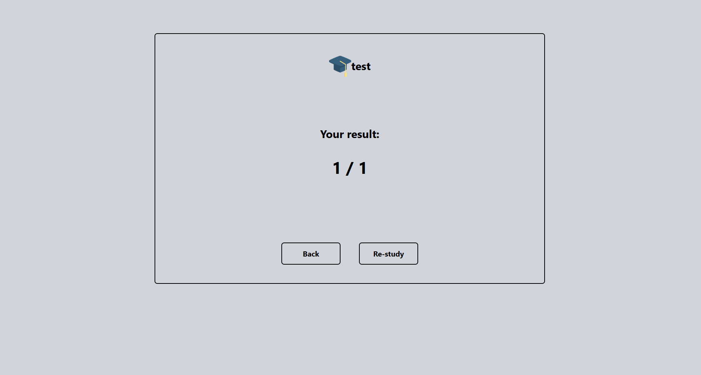

### Friends & Messaging
Send a friend request, then chat once it's accepted.

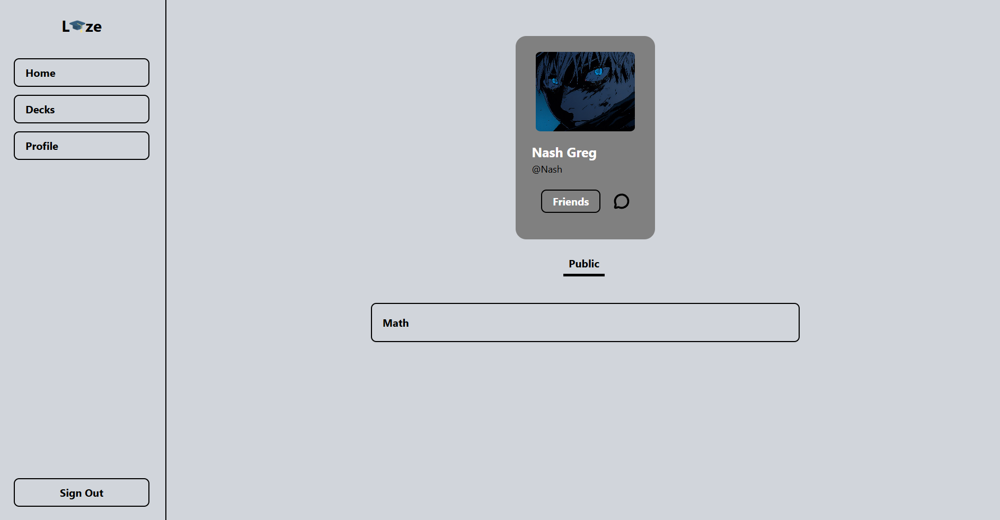
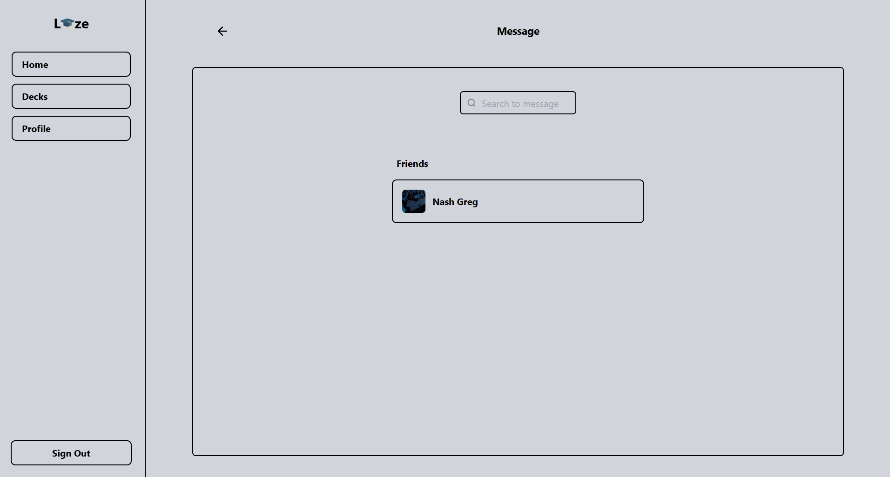
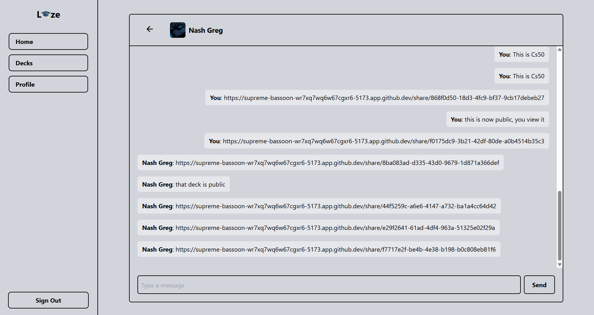

### Profile & Search
Check out your profile, or find other users and public decks.

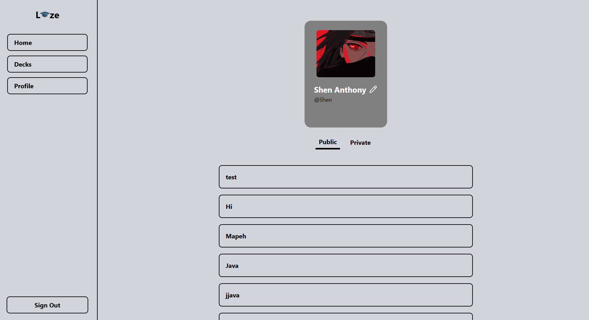
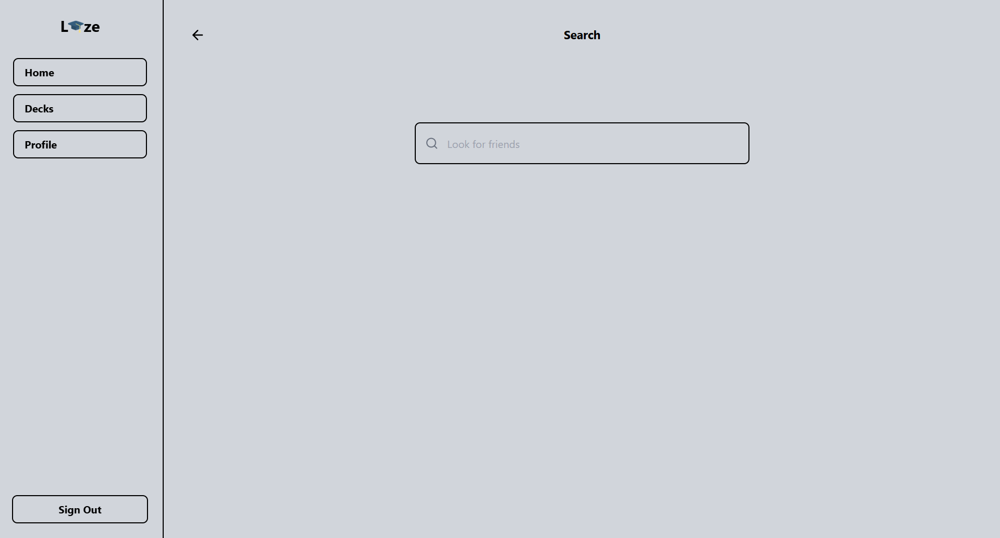

---

## Pages

`src/pages` is where the top-level routes live:

- **`Login.jsx`** / **`Signup.jsx`** — sign in or make an account through Supabase Auth.
- **`Signout.jsx`** — kills the session and kicks you back to login.
- **`Dashboard.jsx`** — the landing spot after login. Pulls decks, friends, and studying together so you're not hunting through menus.

---

## Components

Most of the actual logic lives in `src/components`.

### Profile
`ProfileCard.jsx` shows a user's avatar, name, and username, and lets the owner flip between **Public**, **Private**, and **Stats** tabs. It also handles avatar uploads — when you pick a new photo, it gets resized to a max of 512px and re-compressed as a JPEG at 80% quality before it's uploaded. I added that on purpose because phone camera photos can be several megabytes, and uploading those raw for a tiny circular avatar is just wasted bandwidth and storage for basically no visible quality difference.

`Public.jsx`, `Private.jsx`, and `Stats.jsx` are what actually render inside those three tabs — public decks, private decks, and study stats.

### Decks & Studying
`Decks.jsx`, `Createdeck.jsx`, `DeckDropDown.jsx`, `Cards.jsx`, and `QandA.jsx` make up the deck-building side — create a deck, add questions, each one with four options and a single correct answer. I kept it multiple-choice only on purpose. No short answer, no matching. Keeping the question format that narrow kept both the data model and the grading logic dead simple — same move Gizmo makes with its own quizzes, and it's worked well.

`Study.jsx` is the actual quiz screen — walks you through a deck one question at a time and tracks your score as you go.

`ShareStudy.jsx`, `ShareTotal.jsx`, and `Total.jsx` handle publishing a deck and showing results, so people can see how they did and study from decks that have been shared.

### Friends & Chat
`AddFriendButton.jsx` and `Notification.jsx` handle friend requests. It's not instant-friending — more like Facebook's model. Sending a request inserts a row into a `friends` table with a `pending` status, and it only flips to `accepted` once the other person confirms it.

`Message.jsx` and `Chat.jsx` build on top of that. Messaging is real-time through a Supabase Realtime channel listening for `INSERT`s on the `messages` table, so new messages just show up — no polling.

> One thing I went back and forth on: how to get a friend's name and photo into the chat screen. My first instinct was to just have `Chat.jsx` fetch it itself in a `useEffect` every time the page loaded. Instead I pass it through React Router's `navigate(path, { state })` from `Message.jsx`, since that data's already sitting there the moment you click a friend — no need for another DB round trip. Downside is that state disappears on a hard refresh. If I keep building this out, the fix is a fallback fetch keyed on the room ID.

To make pulling friends and avatars less painful, I wrote a `my_friends` SQL view over the `friends` and `profiles` tables. It uses `auth.uid()` to figure out who "the other person" is relative to whoever's logged in, and only returns accepted friendships. So instead of writing that join in JS every time, `Message.jsx` and `Chat.jsx` just run `select * from my_friends` and get name, username, and photo back in one go.

### Everything Else
- `Ai.jsx` — placeholder for a feature I haven't built yet: some kind of AI layer that helps generate or refine practice questions.
- `Search.jsx` — search for decks or people.
- `Sidebar.jsx`, `Upperbar.jsx`, `Footer.jsx`, `Greetings.jsx` — the nav and layout shell that wraps everything.
- `Edit.jsx`, `Delete.jsx`, `Popup.jsx`, `Return.jsx`, `Stalk.jsx` — smaller pieces used all over: editing stuff, confirming deletes, modals, a back button, and viewing someone else's public profile.

### Supabase Client
`supabaseClient.js` just sets up one shared Supabase client that the whole app imports, so every page and component is talking to the same session and connection.

---

## Tech Stack

| Layer | Tech |
|---|---|
| Frontend | React |
| Database | Supabase (Postgres) |
| Auth | Supabase Auth |
| Storage | Supabase Storage |
| Realtime | Supabase Realtime (`INSERT` subscriptions) |
| Routing | React Router |

---

## Project Structure

```
images/
├── Card.png
├── Chat.png
├── Dashboard.png
├── Decks.png
├── Friends.png
├── Landing.png
├── Message.png
├── Profile.png
├── Quiz.png
├── Result.png
└── Search.png

public/

src/
├── admin/
│   ├── AdminDashboard.jsx
│   ├── AdminLayout.jsx
│   ├── AdminLogin.jsx
│   └── AdminRoute.jsx
├── assets/
├── components/
│   ├── Home/
│   │   ├── Ai.jsx
│   │   ├── Chat.jsx
│   │   ├── Home.jsx
│   │   ├── Message.jsx
│   │   ├── Notification.jsx
│   │   └── Search.jsx
│   ├── pages/
│   │   ├── Dashboard.jsx
│   │   ├── Landing.jsx
│   │   ├── Login.jsx
│   │   ├── Signout.jsx
│   │   └── Signup.jsx
│   └── profile/
│       ├── Profile.jsx
│       └── ProfileCard.jsx
├── App.jsx
├── index.css
├── main.jsx
└── supabaseClient.js
```

*(Heads up — some of the components mentioned above like decks, study, and friends live inside `Home`, `pages`, and `profile` rather than a flat `components` folder, just to keep things organized as the project grew.)*